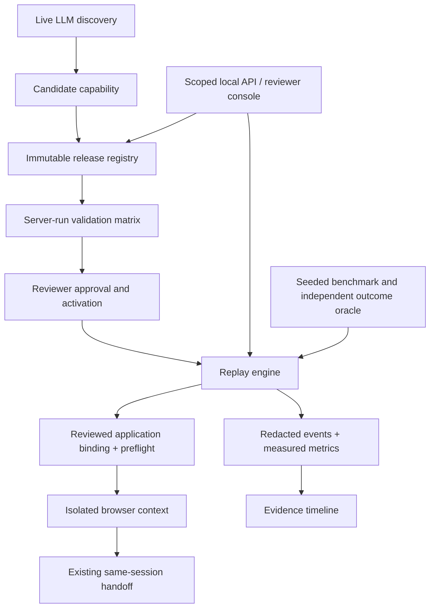

# Verification-first capability platform

## Scope and trust boundaries

Extend the existing single-process, read-only synthetic banking runner. Preserve the
version 1 capability format, genuine discovery, no-model replay, redacted evidence,
and same-browser handoff. No arbitrary site execution or automatic AI repair is added.

The control service binds only to 127.0.0.1 and owns its synthetic application URL.
Callers cannot supply URLs, policy, filesystem paths, executable selectors, or model
credentials. Separate random reviewer and runner bearer tokens authorize endpoints.
The reviewer can import, validate, approve, activate, and roll back; the runner can
invoke approved releases and read redacted evidence. No token is saved in evidence.
Tokens identify local roles, not enterprise user identities.

## Five additions

1. **Benchmark**: seeded scenario schedule with seeded response delays, both reviewed
   variants, independent typed-output oracle, expected failures/business outcomes,
   explicit manual-stand-in scenarios, zero-model accounting, recovery metrics and
   latency percentiles. Every trial is retained, with no retry-to-green. Reports bind
   to the artifact digest and environment. Repeat schedules, not wall-clock timings.
2. **Bindings and drift**: canonical capability semantics map to a table layout or
   a reviewed card layout. Required controls/labels are checked before actions.
   Unknown, missing, or ambiguous contracts fail closed; arbitrary page content is
   never copied to diagnostics. No first-match selector fallbacks.
3. **Evidence console**: scenario selector, run progress, safe checkpoint timeline,
   model-call metrics and links to local run records. DOM text is assigned with
   textContent, not HTML assembled from artifacts. No raw sensitive outputs on disk.
4. **Release lifecycle**: immutable id/version/digest, server-generated validation
   bound to artifact and runner/dependency digests, explicit approval, atomic activation, and rollback to a previously
   approved release. Serialized writes plus a process lock protect a local registry.
   Hashes detect accidental corruption, not an attacker who controls the filesystem.
5. **Capability API**: authenticated catalog, invocation, run evidence, validation and
   release routes. Strict bounded JSON, exact Host/Origin checks, request timeouts,
   rate limits and bounded run concurrency. OpenAPI documents the actual contract.

## Initial self-review and design changes

| Risk in a naive design                              | Chosen correction                                                                          |
| --------------------------------------------------- | ------------------------------------------------------------------------------------------ |
| Client submits a passing validation report          | Validation is executed by the server against the stored digest                             |
| Approval survives editing an artifact               | Versions are immutable; digest checked before every use                                    |
| Approval survives a runner or dependency change     | Invalidate old validation/approval on service startup when the trusted-code digest changes |
| Hidden AI repair violates replay contract           | Replay refuses model access; changes require a new candidate                               |
| Generic URL/API becomes SSRF                        | API accepts only fixed synthetic bindings and scenario enums                               |
| Viewer exposes arbitrary files or HTML              | UUID lookup within owned run root; redacted records; safe DOM rendering                    |
| Rollback accidentally selects an unreviewed version | Only approved releases eligible, explicit target and audit entry                           |
| Benchmark counts expected denial as failure         | Independent expected-outcome oracle and separate unsafe-success count                      |
| Report hides transient failures with retries        | Keep every trial and first-attempt outcomes; no automatic trial retries                    |
| Unlimited browser launches exhaust machine          | Single active execution; competing mutations receive conflict                              |

## Verification contract

Existing tests must continue to pass. Add browser tests for both bindings and drift,
API tests for every role and lifecycle transition, tamper/concurrency/body/origin/
path tests, viewer desktop/mobile tests, and measured 100-trial benchmark evidence.
Run a fresh live discovery after integration. Review the final implementation against
this document and record discrepancies, fixes, residual limitations and OWASP sources
in SECURITY_REVIEW.md. This is an engineering review, not a certification or bank audit.
