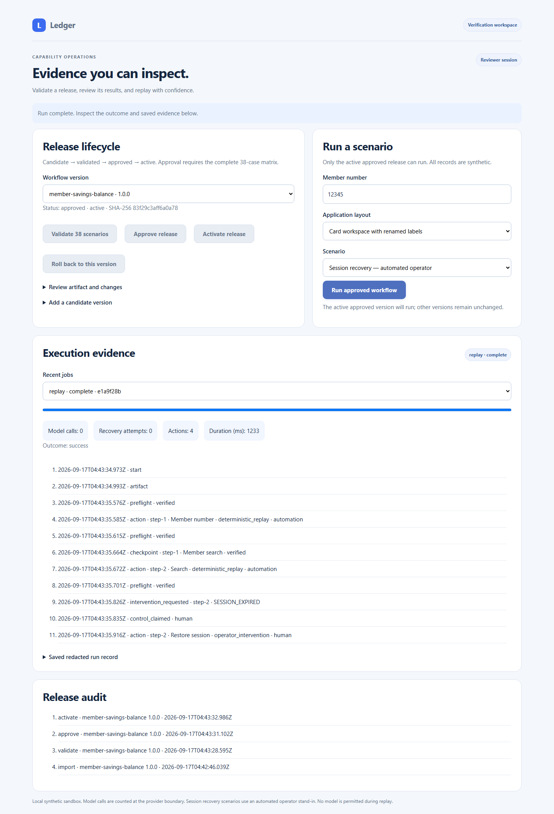

# Legacy Capability Runner

A small computer-use backend for a synthetic bank servicing app. An OpenAI model discovers a real browser workflow; the resulting typed capability replays without any model. The demo app uses an iframe and table-labelled inputs, without test IDs.

The verification platform adds **two reviewed layouts, incompatible-UI detection,
a reproducible benchmark, an evidence console, immutable release approval/rollback,
and an authenticated capability API**. It remains a local synthetic assessment,
not a production bank integration.



## Reviewer quickstart (no API key needed)

After installing dependencies below:

```powershell
npm.cmd run console
```

Open the private **Reviewer console** URL printed in your terminal. On first launch:
**Validate 38 scenarios → Approve release → Activate release → Run approved workflow**.
Validation takes about a minute on the development machine; it launches real
Chromium runs, not canned results. The UI enforces sequencing and the server checks
it independently. Try the card layout, session recovery, permission denial and UI
drift scenarios. Inspect checkpoints, control ownership and zero-model metrics.

For a new evaluation workspace use `npm.cmd run console -- --dir runs/reviewer-new`.
The default port is 4180; override with `--port 4181`. The separate Runner URL can
invoke active releases but cannot change their lifecycle. Both tokens are temporary
local role credentials, not production identity management.

Reproduce the reliability measurement:

```powershell
npm.cmd run benchmark -- --count 100 --seed 20260916 --out runs/my-benchmark
```

The report retains **every trial**, exact expected/actual outcomes, artifact and
runner digests, recovery rate, unsafe-success count, model calls, and latency
percentiles. A correct permission denial is counted as the expected outcome, not a
successful balance lookup. The seed reproduces scenario order and injected delays,
not elapsed times. See [recorded results](evidence/platform/README.md), the
[manual checklist](MANUAL_TESTS.md), [architecture](ARCHITECTURE.md), and
[security self-review](SECURITY_REVIEW.md).

## Capability API

The API binds to 127.0.0.1 and starts its own synthetic bank app. It accepts no
external URL or policy override. Use the token from the Runner URL fragment in an
`Authorization: Bearer ...` header. Never put it in source control.

| Endpoint | Role | Purpose |
| --- | --- | --- |
| `GET /api/capabilities` | Runner / reviewer | Active approved capabilities and contracts |
| `POST /api/invoke` | Runner / reviewer | Start a replay job; returns 202 with job ID |
| `GET /api/jobs/{id}` | Runner / reviewer | Status and typed result in memory |
| `GET /api/runs/{id}` | Runner / reviewer | Redacted events, metrics and saved result |
| `GET /api/releases` | Reviewer | Releases and audit history |
| `POST /api/releases/import` | Reviewer | Import an immutable candidate artifact |
| `POST /api/releases/validate` | Reviewer | Run the server validation matrix |
| `POST /api/releases/approve` | Reviewer | Approve a validated candidate |
| `POST /api/releases/activate` | Reviewer | Select an approved version |
| `POST /api/releases/rollback` | Reviewer | Restore a previously activated version |

Invocation body:

```json
{"id":"member-savings-balance","memberId":"67890","variant":"cards","scenario":"normal"}
```

Lifecycle bodies use `id` and `version`; import accepts the capability object.
The complete [OpenAPI document](schema/control.openapi.json) is also served at
authenticated `GET /api/openapi`. One execution is allowed at a time; competing
mutations return 409. Bodies are bounded to 64 KiB. Model credentials are never
needed by this API. Direct replay/discovery CLI commands remain developer tools;
the approval gate applies to the control API.

Releases and validation references survive restarts. Recent jobs and unredacted API
outputs are memory-only. A changed trusted runner/policy/dependency digest revokes
old approvals on startup and requires revalidation. After a process crash, confirm
it has stopped before removing its empty `runs/control/registry/.lock` directory.

## Setup

Requires Node.js 22 or newer and npm. Tested on Windows with Node.js 24.

```sh
npm ci
npx playwright install chromium
```

On Linux CI, install browser system libraries with `npx playwright install --with-deps chromium`.

Copy `.env.example` to `.env` and set `OPENAI_API_KEY`. The default model is `gpt-4.1-mini`; set `OPENAI_MODEL` to override. Alternatively set `SOURCE_ENV_FILE` in your local `.env`: the loader imports **only OPENAI_API_KEY** from that file. No key is needed for replay or tests. Neither the source file nor `.env` belongs in git.

## Exact demo path

A single command starts the local app, runs genuine LLM discovery, then replays the recorded artifact with another member, a not-found member, a recoverable notice, and a permission denial:

```sh
npm run demo -- --out evidence
```

Or run discovery and replay separately:

```sh
npm run discover -- --goal "Look up member {memberId} and read their savings balance and currency from the balance summary." --member 12345 --out runs/my-discovery
npm run replay -- --artifact runs/my-discovery/capability.json --member 67890 --out runs/my-replay
```

Each command starts and closes its own real local app and isolated Chromium session. The artifact contains the entry path, never a machine-specific host or port. You can also run `npm run app` and pass `--target http://127.0.0.1:4173/app` to discovery. Only the configured ledger profile is supported; this is not a general-purpose arbitrary-website agent.

## Visible demo speed and guided handoff

Run the visible demo with readable defaults:

```powershell
npm.cmd run demo -- --headed --out runs/manual-demo
```

Headed commands wait **2 seconds before each automation action** and hold each result screen for **5 seconds** before closing its browser. The current target is highlighted and a status strip describes the action. Headless runs keep their fast defaults.

Override the timing when presenting:

```powershell
npm.cmd run demo -- --headed --action-delay-ms 3000 --final-hold-ms 10000 --out runs/manual-demo
```

Both values are milliseconds. Action delay accepts 0–10000 and final hold accepts 0–30000. Use 0 for both to turn presentation delays off. These settings change presentation only, not recorded capabilities or policy decisions.

The operator console enforces the sequence:

| State | Available action |
| --- | --- |
| Before claim | **Claim control**; Restore and Resume are disabled |
| Claimed, unresolved | **Restore session**; Resume remains disabled |
| Recovery verified | **Resume automation**; the completed recovery action disappears |
| Resumed or stopped | All intervention controls are disabled |

The server independently rejects premature resume requests. Replay requires the paused checkpoint to match before the console enables Resume. The responsive banking and operator screens retain the iframe/table targeting used by existing artifacts. Form labels, instructions, status feedback, and keyboard focus follow [W3C WAI form guidance](https://www.w3.org/WAI/tutorials/forms/); no formal accessibility conformance audit is claimed.

After source updates, stop an old `npm run app` process with Ctrl+C, start it again, and refresh your browser.

## Run without live services

Use the committed, genuinely discovered artifact:

```sh
npm run replay -- --artifact evidence/capability.json --member 67890
npm run replay -- --artifact evidence/capability.json --member 00000
npm run replay -- --artifact evidence/capability.json --scenario transient
npm run replay -- --artifact evidence/capability.json --scenario permission
npm run verify
```

Replay never constructs a model client. Tests that exercise the discovery control loop use an explicitly labelled `test-fixture` provider; those tests are not claimed as model evidence.

Supported fault scenarios: `notice`, `transient`, `slow`, `validation`, `permission`, `session`, `app_error`, `unknown_dialog`, and `ambiguous`. The not-found case uses member `00000`. Invalid input fails before browser launch.

## Real operator handoff

```sh
npm run handoff -- --artifact evidence/capability.json
```

The command injects session expiry and prints a private localhost operator URL. Open that URL while the command is still running:

1. Click **Claim control**.
2. Click **Restore session**. This operates the existing target browser session.
3. Click **Resume automation**. Replay verifies its paused checkpoint and continues.

The console exposes the live session through semantic controls; it is deliberately not a pixel-streaming remote desktop. The browser context and cookies remain the same. Automation is paused while the human owns the session. Actions are audited without field values. Risky transfers are blocked even for the operator. Unclaimed/abandoned handoffs time out after two minutes.

Use `--operator` on discovery/replay to enable this path for other failures. Discovery can resume after human actions and records replayable manual actions in its artifact. Without an attached operator, a failure creates a durable intervention entry and closes the browser; it cannot later resume a closed session.

`npm run test:handoff` drives this actual console with an automated stand-in for a person and saves same-session handoff evidence plus a redacted console screenshot.

## Result contract and evidence

`replay(artifact, options)` in `src/engine.ts` returns one of:

- `success`: typed `outputs`, including numeric `savingsBalance` and string `currency`.
- `business_outcome`: `NOT_FOUND` or `VALIDATION`.
- `failure`: stable error code, step, expected state, redacted observed state, and intervention ID.

Outputs are returned to the caller in memory and displayed by the demo CLI. Persisted result files redact their values. Treat stdout as sensitive if replacing this synthetic demo with real data.

Each run folder contains structured `events.jsonl` and `result.json`. Discovery also emits `capability.json`. Failures include `failure.snapshot.json`, a semantic DOM snapshot containing only approved labels, controls, heading states and filled/empty flags. Raw page HTML, screenshots of banking data, model transcript, credentials and parameter values are not saved.

See [evidence/README.md](evidence/README.md) for recorded runs, [REPORT.md](REPORT.md) for design decisions, and [schema/capability.schema.json](schema/capability.schema.json) for the exported schema. Zod also validates cross-field references and profile rules that JSON Schema alone cannot express.

## Verification and layout

```sh
npm run verify
npm run test:handoff
npm run audit
npm run schema
```

- `src/schema.ts`: capability and result contracts.
- `src/engine.ts`: discovery, deterministic replay, checkpoints, recovery.
- `src/surface.ts`: browser perception and actions.
- `src/policy.ts`, `config/policy.json`: risk, network, target and action allowlists.
- `src/handoff.ts`: live control transfer and minimal operator console.
- `src/model.ts`: real OpenAI Responses API adapter.
- `src/evidence.ts`: allowlist-based persistence.
- `src/demo-app.ts`: synthetic legacy banking UI.
- `test/system.test.ts`: behavioral unit and real-browser integration tests.

Default policy allows one exact origin, a short list of GET routes and query keys, and explicit action/control types. Review configuration and application profiles as code. This is a take-home vertical slice, not a production banking integration.

## Submission

The assignment requests a public repository and a link sent from the applicant's email address to `assignments@interface.ai`. Sending that email is a separate submission action.

## References

The implementation uses [OpenAI Structured Outputs](https://developers.openai.com/api/docs/guides/structured-outputs) for constrained discovery decisions and [Playwright locators](https://playwright.dev/docs/locators) for browser targeting.
