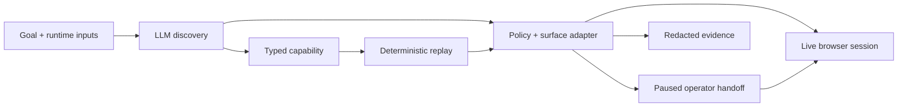

# Computer-Use Automation System

## Architecture

The implemented vertical slice reads a synthetic member's savings balance: member search, detail screen, then balance summary. A local HTTP app deliberately uses a named iframe and table-labelled inputs without test IDs. This exercises a legacy-web seam while staying reproducible and using no real banking data or external application API.

A single Node.js/TypeScript process owns the run, policy, browser context, evidence sink and optional operator server. Discovery calls the OpenAI Responses API with a redacted observation and a constrained action schema. The model chooses the next action; the surface adapter performs it against Chromium. The successful run compiles to a capability. Replay loads that capability and executes it without constructing a model client. This keeps orchestration understandable and avoids queues or services before they are needed.

The model sees approved labels, available controls, headings and filled flags, not field values, balances, raw HTML or screenshots. The input/output contract is chosen by the supported capability profile; the model discovers the UI sequence rather than inventing a contract. This intentionally narrows scope to one real, tested integration.

## Artifact schema

The strict, versioned artifact defines capability identity and version, vendor product/profile/version, relative entry path, typed inputs and outputs, ordered actions, per-step checkpoints, a final success condition and provenance. A fill stores a parameter reference, never the concrete member number. Output declarations carry extraction targets and sensitivity. A published JSON Schema supports review; Zod and profile validation additionally reject dangling parameters, duplicate step IDs, unsupported versions, unapproved controls and forged final checkpoints.

Targets describe semantics: frame plus exact role/name, or the relationship between a table's label cell and value/control cell. Neither generated IDs nor recorded coordinates are used. A locator must resolve uniquely; ambiguity stops execution. The frame boundary and table relationship are deliberate robustness decisions, not a fallback to whichever element matches first.

Artifacts contain concise action rationale codes and provider/run provenance, not model transcripts. A real API response ID and usage receipt are recorded in discovery logs. Test fixtures carry distinct provenance. The artifact has no deployment origin, credentials, input values or tenant identity.

## Determinism & error handling

Replay binds an origin and validates inputs before launching the browser. It executes the recorded actions, checks each postcondition, verifies the final summary, verifies that its member number matches the invocation, and type-checks extracted outputs. An input fill does not imply a page transition: its checkpoint is the current heading. Browser navigation is awaited and observations are captured atomically, preventing mixed old/new page snapshots.

The result is a discriminated union. Missing members and app validation errors are expected business outcomes. A known service notice or transient/loading screen receives a bounded, explicitly configured Continue/Retry action. Permission denial, expired sessions, application errors, unknown confirmations, ambiguous targets and checkpoint timeouts stop with step/expected/observed context. Risky actions never receive an automatic retry. Recovery has both an attempt limit and a run deadline; discovery also has a step budget and repeated-action detection.

No model assists replay. Timing is bounded rather than literally identical; deterministic means fixed decisions, targeting and recovery rules for a given state. Tests include changed parameters, business outcomes, recovery exhaustion, hard failures, invalid artifacts, forged checkpoints, deadlines, ownership, resumed discovery, and the actual operator UI.

## Heterogeneity & multi-tenant

The Surface contract separates observe, perform, check and extract from flow semantics. The implemented adapter knows how to map semantic targets to iframe/table DOM relationships. A desktop adapter could map the same operations to UI Automation/AX control paths; a pixel-only adapter would need versioned visual anchors, confidence thresholds and explicit ambiguity rejection. Such adapters are not implemented, and today's target schema would need a new backward-compatible target variant.

For reuse, keep a vendor/version capability separate from a tenant binding: origin, credential reference, locale and reviewed control-label overrides. Bindings must not widen policy. A versioned profile should carry a surface fingerprint and required control contracts. Validate those in a read-only preflight and replay a canary before rollout. Unknown variants fail closed and create a review request; do not silently repair production flows. Store an immutable base artifact plus reviewed, narrowly scoped overrides and per-variant evidence. Current code binds an origin and validates a profile but does not claim production tenant management or automatic version-drift detection.

## Escalation & handoff

Ownership is explicit: automation, paused, human, then automation or closed. A blocked run writes an intervention with reason, step, session ID and redacted state. With operator mode enabled, it keeps that same browser context alive and exposes a loopback console protected by an ephemeral bearer token. Claim transfers ownership. Console actions use the same surface and policy, so they actually drive the paused session. Resume returns control and replay verifies the checkpoint rather than blindly repeating the previous action. Manual actions and ownership changes are audited.

The server serializes mutating requests and rejects unauthorized, unclaimed, duplicate or concurrent operations. Tokens stay out of evidence. Abandonment times out closed. Discovery can resume too: approved manual flow actions are recorded with observed checkpoints; known recovery actions stay in recovery policy. Without a connected operator, a durable intervention remains, but the browser is closed and that session cannot be resumed.

The UI is minimal; the mechanism is real. An automated stand-in clicks the console in the evidence demonstration. No human participation is falsely claimed. A production operator service needs authenticated identity, durable leases, access controls and isolated session workers.

## Safety

An explicit policy constrains exact origin/routes, query keys, HTTP method, action kinds and semantic controls. Every browser request is checked; popups, downloads, service workers and WebSockets are blocked. Link/form destinations are checked before clicks. Risk comes from trusted profile code, never from the model or artifact: transfers are blocked for both automation and operators. Page content is data, not authority.

Persistence uses approved fields rather than attempting to scrub arbitrary dumps. Input values, outputs, query strings, model free text and raw browser errors are excluded from saved evidence. Failure snapshots expose only approved UI structure. Runtime outputs are returned to callers; the synthetic CLI displays them, so a real deployment must protect its output channel. Model requests use store:false and receive redacted observations. Secrets are read locally, never committed, and an audit compares deliverable files against the configured key without printing it.

These controls are not a complete security boundary against a malicious application: a permitted control or GET endpoint could itself cause a side effect. Production needs independently reviewed app profiles, network isolation, hardened browser workers, data classification and provider retention agreements. This implementation uses only a controlled synthetic app.

## Cuts

One read-only capability, one vendor profile, one browser surface and a local operator console are implemented. No real bank integration, arbitrary-site discovery, desktop adapter, multi-tenant infrastructure, screenshot/OCR targeting, credential login, signed artifact approval or production operator authentication is claimed. Native dialogs are dismissed and surfaced as failures; only known HTML interstitials recover automatically.

The priority was a complete trace from genuine model discovery to reusable artifact, no-model replay, exceptional outcomes, live takeover and evidence. Next would be immutable reviewed artifact releases, broader profile contracts, bounded session renewal, deployment-specific retention and a second vendor/tenant variant. Scaling workers comes after those correctness and isolation boundaries are proven.
